  
  

# English 
<h3 align="center">
  <a href="https://github.com/Roberto-deP-Martins/Roberto-deP-Martins/README.md">Versão em Português</a>&nbsp;&nbsp;&nbsp;&nbsp;&nbsp;&nbsp;&nbsp;&nbsp;&nbsp;&nbsp;&nbsp;&nbsp;&nbsp;&nbsp;
  <a  href="https://github.com/Roberto-deP-Martins/Roberto-deP-Martins/README-FR.md">Version Française</a>
</h3>

## <b>Hello! 👋</b>
Information Systems graduate at Universidade Federal Fluminense (UFF). Currently working on mobile software development at <a href="https://calindra.tech/">Calindra</a>. 

## <b>Skills 👨‍💻</b>
  &nbsp;&nbsp;&nbsp;&nbsp;&nbsp;&nbsp;&nbsp;
  &nbsp;&nbsp;&nbsp;&nbsp;&nbsp;&nbsp;&nbsp;
  &nbsp;&nbsp;&nbsp;&nbsp;&nbsp;&nbsp;&nbsp;
  &nbsp;&nbsp;&nbsp;&nbsp;&nbsp;&nbsp;&nbsp;
  &nbsp;&nbsp;&nbsp;&nbsp;&nbsp;&nbsp;&nbsp; 
  &nbsp;&nbsp;&nbsp;&nbsp;&nbsp;&nbsp;&nbsp; 
  &nbsp;&nbsp;&nbsp;&nbsp;&nbsp;&nbsp;&nbsp; 
  

## <b>Contact info 📩</b>

  
  &nbsp;&nbsp;&nbsp;&nbsp;&nbsp;&nbsp;&nbsp;
  

